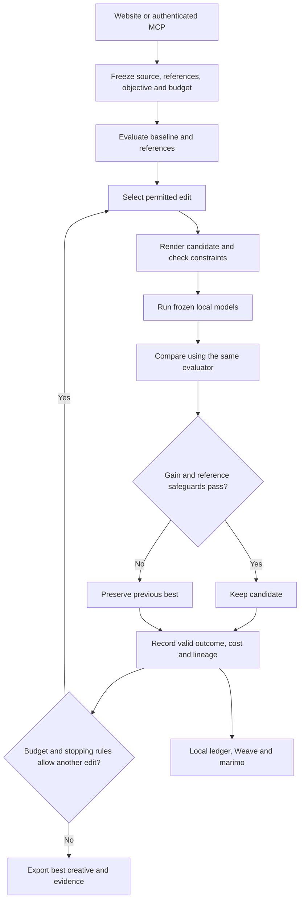

# Agentic loop: implementation and proposed next version

See [the source-based three-loop audit](THREE-LOOP-AUDIT.md) for the comparison with the original creative-reasoning, transferable-learning and strategic-repair design. The current workflow does not yet fulfill all three loops; operational recovery must not be presented as complete strategic self-healing.

Reviewed September 11, 2026. This is the requested design for review, not a claim that all release gates passed. The proposed benchmark and expanded learning design below have not been activated.

NeuroLoop currently changes creative media through a bounded set of edits, evaluates those changes with frozen models, and keeps or rejects them using fixed rules. It learns operator outcome statistics within an exact context. It does not train its neural models, read actual viewers' thoughts, or establish that a creative will sell better.

## Current flow

1. `services.py` validates the request and snapshots the project. A later project edit must not change an experiment already underway.
2. `worker.py` evaluates the original and required references. Cached evaluations must match the model profile and device contract; missing values are not replaced with invented scores.
3. `strategy.py` and `policy.py` select typed, permitted operators. Contrast changes are ±8%, brightness ±0.035, saturation ±12%, and headline timing ±0.75 seconds where supported. These are actual controlled edits, not a text-to-image generation service.
4. The renderer preserves required source constraints. Invalid candidates are rejected before they can count as useful learning observations.
5. Local inference computes cortical responses. Optional TSAM receives the stimulus independently; Kragel computes diagnostic pattern expression from TRIBE output. These sources have different scientific meanings.
6. Acceptance compares the candidate against the current best under the unchanged objective. A gain alone is insufficient when a per-reference safeguard fails. Rejection preserves the previous best.
7. At most three sibling candidates are selected; expensive execution remains serialized under the shared worker lock. Evaluation/time limits and stopping conditions bound the search.
8. The ledger preserves candidate lineage, scores, decisions, timings and failures. Exports contain the selected media and its evidence.

## What improves, and what does not

The current policy samples each permitted operator from a Beta distribution with parameters `1 + successes` and `1 + failures`, divided by its observed mean execution cost. A stable seed makes selection reproducible. Only finite, valid outcomes update statistics; a tradeoff is not a successful improvement.

The context hash includes the evaluator, target, model profile, references and constraints. Consequently, experience in one context does not demonstrate improvement on unrelated ads. Very specific context keys can also leave new projects with almost no reusable experience. This is a real adaptive operator policy, but its benefit over a fixed policy remains unmeasured.

TRIBE and TSAM weights remain frozen. An increasing internal score is not proof of human preference, attention, emotion or commercial effectiveness. Optimizing a model-derived objective can exploit that objective without improving the real-world result.

## Self-healing boundaries

Implemented recovery includes cancellation, bounded process supervision, stale-run handling, shared execution locks, atomic evidence writes and retryable external telemetry delivery. Failed exports must remain failed or retrying until remote readback confirms them. These mechanisms protect completed results and expose failure states.

There is no autonomous graphics-driver repair, arbitrary code repair/deployment, unbounded retry, or automatic scientific approval. The Windows hold remains intact; its diagnosis is outside this requested work. CPU verification is an explicitly selected bounded path, not a general removal of that hold.

## Proposed next loop — for review, not activated

Keep the frozen evaluator and bounded execution contract. Improve the policy only after an honest baseline comparison:

1. Define the intended outcome before looking at test results. Use model-score gain for an engineering benchmark; use independently measured labels for any human-outcome claim.
2. Group ads by source/campaign and split development from held-out evaluation. Do not let edits of the same creative cross that boundary.
3. Compare a fixed operator schedule, seeded random selection, the existing rule strategy and the adaptive policy with equal wall-time/evaluation budgets.
4. Freeze learned priors before held-out evaluation. Report online adaptation separately; never tune against the final test set.
5. Record paired seeds and source hashes. Report mean/median gain, constraint violations, completion rate, compute cost and uncertainty resampled at the independent creative/campaign level.
6. Count failed and timed-out trials. Do not discard them to make efficiency or reliability appear better.
7. Only widen policy context sharing after showing it helps new projects without violating evaluator compatibility. Keep full provenance of the experience used.
8. Give ARIA the trace-linked results and ask for a bounded next hypothesis. Require local acceptance rules to decide whether the resulting candidate is kept.

Success means reproducible improvement over a fixed baseline on unseen material under the same budget. It does not mean the highest internal score from one favorable run. Prize probabilities cannot be credibly estimated without judging criteria, competitors and comparable evidence.

## Evidence needed to establish loop improvement

The current policy is implemented, but its advantage over a fixed baseline has not been established on held-out creatives. Use the benchmark above before claiming general improvement. Recovery should be evaluated with controlled timeout, cancellation, worker interruption and export-failure cases, proving that completed artifacts survive and retries stay within budget.

This document covers the loop only. Model validation and permission requirements are tracked separately in SCIENTIFIC-VALIDATION-AUDIT.md and REMAINING-WORK.md.
