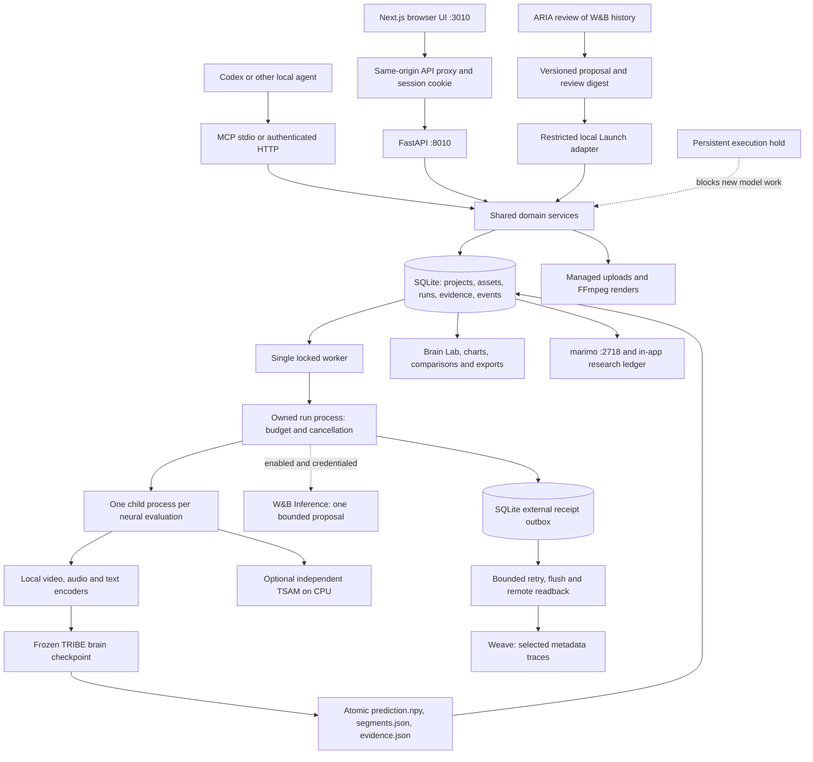

# NeuroLoop architecture

This document describes the implementation inspected during the September 10,
2026 operational audit. The system lives in `D:\NeuroLoop` and runs on one laptop.
See [AUDIT.md](AUDIT.md) for measured results and [REMAINING-WORK.md](REMAINING-WORK.md)
for gaps. Implemented does not mean scientifically validated or ready for public deployment.

**Recovery state:** GPU work and Launch are currently held by `data/inference-quarantine.json` after the 21:47 Pacific graphics crash. The flow below describes implemented execution; only review/API/research services run while the hold exists.

## What the product actually does

NeuroLoop accepts media, predicts an average cortical response with pretrained
TRIBE v2, compares saved responses, and runs bounded edits against a fixed
reference-similarity objective. It records the inputs, predictions, changes,
costs and acceptance decisions. The browser and MCP use the same domain services.

It is an application built around pretrained models, with real orchestration,
inference, numerical scoring, storage and visualization. It is not a newly trained
foundation model or a measurement of a viewer's brain. The audit verifies numerical
output, not biological accuracy, ad effectiveness, preferences or purchase intent.

## Runtime and data flow



`scripts/manage.py` owns the API, Next.js server, research app and, when execution is enabled, the worker and restricted Launch agent. The current hold omits both executors.
Windows job objects bind descendant lifetime to their owning supervisor. The
worker uses a file lock to serialize GPU jobs. The API queues work and returns
a run ID rather than keeping a request open for inference. Polling and recorded
run events provide progress. All three web services bind to loopback.

## Folder and responsibility map

| Location | Responsibility |
|---|---|
| `frontend/src/app` | Next.js routes, styles, authentication exchange and API proxy |
| `frontend/src/components` | Landing, workspace, forms, charts, Brain Lab, research and connections |
| `frontend/src/lib` | Shared browser API helpers and types |
| `frontend/public/brand` | NeuroLoop logo/favicon; generated Neuro assistant ribbon and authored SVG companion |
| `backend/neuroloop/api.py` | Authenticated endpoints, upload, frames, regions, comparison and ZIP export |
| `backend/neuroloop/services.py` | Validation, immutable run contracts, queue creation and workspace queries |
| `backend/neuroloop/mcp_server.py`, `mcp_extensions.py` | Eighteen agent tools over those same services |
| `backend/neuroloop/worker.py` | Job execution, references, cache, experiments, stopping and recovery |
| `backend/neuroloop/inference.py` | Local preprocessing, evaluation subprocess and actual model prediction |
| `backend/neuroloop/readout.py`, `comparison.py` | Numerical summaries and fixed response similarity |
| `backend/neuroloop/policy.py` | Context-specific edit statistics and Thompson sampling |
| `backend/neuroloop/tsam.py`, `anatomy.py` | Independent audiovisual logits and compatible anatomical readout |
| `backend/neuroloop/integrations.py`, `telemetry.py` | Optional planner and Weave export paths |
| `backend/neuroloop/delivery.py` | Durable export status, IDs, retry, flush and readback |
| `backend/neuroloop/execution_guard.py` | Persistent hold and conservative pressure policy |
| `backend/neuroloop/agent_bridge.py`, `launch_contract.py` | Versioned proposal, local approval and strict job contract |
| `backend/neuroloop/migrations.py` | Transactional versioned SQLite migrations |
| `.runtimes`, `infrastructure/runtime` | Isolated environments, inputs and pinned locks |
| `models` | Downloaded feature encoders, readout sources, manifests and local loader |
| `tribev2-balanced-qv-local` | Original brain checkpoint, local INT8 video weights and model environment |
| `research/lab.py`, `theme.css` | Local marimo research interface |
| `data/neuroloop.db` | Durable domain records; do not delete for troubleshooting |
| `data/assets`, `renders`, `results`, `exports` | Managed source files, edits, predictions and exports |
| `data/geometry`, `cache` | Surface/atlas data and feature caches |
| `data/verification`, `logs`, `build-backups` | Evidence, diagnostics and historical backups |
| `scripts` | Service lifecycle, preprocessing setup and verification commands |

The active app uses `.runtimes/app`; model execution uses `.runtimes/model`, and official W&B MCP uses `.runtimes/wandb-mcp`. All are isolated and pinned. Independent app/model rehearsal directories also pass dependency checks. Original system-inheriting environments remain preserved. The complete second-installation model inference gate is still unpassed. Local packaging forks and provenance are documented in RUNTIME-PATCHES.md. Some model directories are junctions; moving their targets breaks them.

## Actual model path

1. Upload validation accepts supported local media. Files are hashed, inspected,
   registered and previewed. Remote media URLs and arbitrary FFmpeg expressions
   are not exposed as public inputs.
2. Video/audio become timed events. Audio is decoded to mono 16 kHz for local speech
   preprocessing. Faster-Whisper supplies word timings when speech is present;
   explicitly provided timings take precedence. Text requires real supplied timing.
3. A static image requires an explicitly acknowledged repeated-frame presentation.
   This is an experimental input adaptation, not proof of thumbnail effectiveness.
4. `models/load_local_tribe.py` selects V-JEPA2 INT8 video features, Llama-3.2-3B
   base NF4 text features and official Wav2Vec-BERT audio features. Audio encoding
   and video hidden-state pooling use CPU; GPU feature/model work is bounded.
   DINOv2-large is downloaded but inactive in the shipped feature configuration.
5. The original TRIBE brain checkpoint predicts using the shared feature timeline.
   The preprocessing grid is 2 Hz; output timestamps come from TRIBE's returned
   segments and must not be replaced by an assumed display rate.
6. Output is a finite `time × 20,484` array, left hemisphere then right, with
   10,242 fsaverage5 vertices each. The code atomically writes the array, returned
   segments and evidence. The audit independently recomputed these summaries.
7. Optional TSAM reads the original audiovisual source separately on CPU. It emits
   eight signed logits per complete five-second window. It is not a TRIBE decoder
   and contributes nothing to the optimization score.

The 20,484 points are **surface vertices, not individual neurons**. The brain UI
shows a cortical mesh, with surface/points/wireframe modes, hemisphere spacing,
timeline, region selection and compatible difference overlays. Destrieux provides
148 anatomical parcels. An anatomical name does not establish a psychological function.

## Optimization and what learns

The numerical objective is `spatially-centered-cosine/eight-normalized-time-bins/v1`.
Each response is interpolated to eight normalized time bins, spatially centered
and normalized per bin; the score is mean cosine similarity. Multiple references
are averaged and a per-reference regression check prevents hiding a tradeoff.

Allowed operators change contrast, brightness, saturation or editable headline
timing. FFmpeg creates actual files; every candidate is evaluated or reuses an
explicitly version-matched evaluation. Minimum gain, evaluation/time budgets,
allowed edits, audio/duration constraints and plateau stopping bound the loop.
There is no open-ended ad generation or arbitrary agent code execution.

Thompson sampling updates success/failure and compute-cost statistics for an edit
within its context. Its randomness selects experiments; it does not fabricate
cortical values. Model weights remain frozen. This is not human-feedback RLHF.
If enabled, W&B Inference may propose the first permitted edit, but cannot change
the scoring function or run budget. Invalid/unavailable proposals leave the local
policy available and are recorded as such.

## Persistence and recovery

SQLite stores assets, projects, runs, evaluations, experiments, events, policy
statistics and archive markers. Run creation snapshots the project and asset
metadata so later edits do not silently change a queued contract. Source hashes,
model profile and preprocessing options form evaluation cache keys. Feature caches
can also be reused; timings therefore are not necessarily cold-start timings.

Each run and each evaluation has an owned process. Per-evaluation exit releases
resident model allocations before the next candidate. Preflight checks GPU
temperature, free VRAM and system RAM; PyTorch allocation is capped at 75% of VRAM.
These are pressure controls, not a driver-crash cure. The supervisor enforces
timeouts/cancellation. Interrupted running jobs are failed, with completed evidence
retained, rather than automatically replaying a potentially problematic workload.

The run supervisor now checks telemetry every three seconds and stops its owned process tree at a conservative 82°C GPU temperature or below 3 GiB available RAM; unavailable telemetry also fails closed. It persists an execution hold before follow-up work can start. These added controls were tested with controlled telemetry and actual sleeping child processes, not a new neural stress test. They cannot guarantee prevention of a kernel crash between checks.

Archive markers hide earlier technical fixtures from the active workspace while
retaining their media and research records. Export ZIPs contain the selected
creative, actual arrays and evidence. `scripts/backup_workspace.py` creates a stopped-service SQLite/media snapshot with path and checksum validation. Restore copies only manifest-listed data to a new destination, relocates stored paths and holds unfinished external exports. A 539-file snapshot was restored and checked in two separate directories. Models, runtime, source and credentials are separate recovery inputs. Automated rotation and a second-machine rehearsal remain unimplemented.

## Access and external services

The UI obtains a local eight-hour session stored in an HTTP-only, SameSite-strict
cookie. The backend validates bearer tokens; MCP HTTP uses the same boundary.
MCP stdio is an explicitly trusted local process with access to the same database.
It is not a per-user security boundary. Sign-out calls the backend revocation endpoint and clears the browser cookie; revoked sessions are rejected by the backend. Recovery verification exercises this behavior.

The app is single-workspace and does not implement accounts, tenant isolation,
billing or public hosting. marimo is a local process, not a separately secured
multi-user research server. Untrusted local programs are outside this boundary.

See [SPONSORS.md](SPONSORS.md) for exactly what leaves the computer when optional
integrations are enabled. Weave and W&B MCP have actual remotely verified results. ARIA reviewed real history; the restricted Launch bridge exists but its latest full experiment crashed, so acceptance remains open. Cloud compute, W&B Inference and TypeSafe are deferred.

## Dedicated Neuro page

`/neuro` redirects to the workspace's Neuro view. It shares session authentication and calls `POST /api/neuro/command`. The five documented commands read the same ledger and receipt services and link to actual saved records. The composer preserves draft text in session storage, reports request errors and shows pixel/elapsed loading only during an actual request. Free-form responses explicitly state that AI conversation is unavailable; there is no enabled LLM, simulated microphone or in-web generation path. MCP connection instructions remain a separate workspace view for external agents.

## Response-target closed loop (September 11, 2026)

NeuroLoop now has two explicit optimization objectives. The original `reference_similarity`
objective is preserved for controlled cortical-pattern research. The new
`response_target` objective does not require a reference creative and is the product loop
used for declared emotion targets.

```text
creative
  ├─> frozen TRIBE ─> predicted fsaverage5 cortical response ─> Kragel pattern expression ─┐
  └─> independent TSAM audiovisual inference ──────────────────────────────────────────────┤
                                                                                             v
                                                                                  transparent ensemble
                                                                                             |
                                                                                       TargetSpec
                                                                                             |
                                                                                 fixed target-distance
                                                                                             |
                                                                             controlled intervention policy
                                                                                             |
                                                                                         candidate
                                                                                             └──> same evaluator
```

### Kragel decoder contract

The seven 2015 Kragel BPLS emotion signatures are used as an **experimental decoder
layer** for TRIBE, as requested for this project. The higher-resolution Kragel surface
files are not index-resampled onto TRIBE. Instead NeuroLoop samples the published MNI
volume maps through the documented Nilearn fsaverage5 white-to-pial cortical ribbon.
Both hemispheres contain 10,242 vertices, matching TRIBE's released cortical head. The
current local projection covers about 96.9% of the fsaverage5 vertices for each source
map. Each TRIBE time point is spatially centered and normalized before expression
against the normalized Kragel signature.

The resulting values are spatial pattern-expression correlations. They are not emotion
probabilities and are not claimed to be measured human reactions. Raw Kragel trajectories,
source hashes, transform profile and limitations remain in each evaluation record.

### TSAM contract

TSAM remains independent from TRIBE. It receives the original audiovisual stimulus and
returns eight uncalibrated class logits in five-second windows. It is never fed a TRIBE
array. Its exact class order is Anger, Contempt, Disgust, Fear, Happiness, Neutral,
Sadness, Surprise. Windows are complete, non-overlapping five-second intervals with a
five-second stride; incomplete tails are omitted and reported. The staged macOS model
environment pins the dependencies required by the upstream
implementation and strict checkpoint loading is required at runtime.

### Response ensemble

`backend/neuroloop/response.py` combines only the explicitly available signals. Current
profile `tsam55-kragel45-relative-evidence-v1` gives TSAM a 0.55 source weight and Kragel
a 0.45 source weight for dimensions both models support. Kragel does not fabricate
contempt or disgust evidence. Source scores, weights and disagreement remain separately
visible. Missing sources cause a transparent degraded calculation, not invented data.

The target metric `response-target-distance/v1` compares these relative model-evidence
values with the user-declared `TargetSpec` and applies a disagreement penalty. It is an
optimization score, not a percentage of viewers predicted to feel an emotion.

`TargetSpec` defaults to a whole-creative objective for compatibility, and can select a
normalized `[0,1]` interval or multiple named intervals. Each source is aligned to the
same source-duration axis and scored only over actual overlap. Short clips, omitted
tails, and disjoint/unsupported dimensions remain explicit missing coverage; changing a
different segment cannot satisfy a selected segment's target. The response provenance
contract records model/checkpoint/preprocessing/geometry/projection metadata plus the
ensemble specification hash.

### Intervention and generation boundary

The closed loop is operational today with the existing deterministic local interventions
(brightness, contrast, saturation and composed-headline timing where applicable). These
are useful controlled interventions and provide an end-to-end search loop without an
external generator.

Ideogram 4 and MiniMax H3 are represented only by `GenerationProvider` capability
contracts with status `awaiting_sponsor_access`. They intentionally fail closed until
sponsor credits/model access are available. No request, result or cloud resource is
fabricated. When enabled later, they must plug into the same candidate/evaluation loop;
they must not create a second optimizer.

### Fixed evaluator rule

TRIBE profile, selected response readouts, ensemble profile, target and acceptance
criteria remain fixed within a run. Only the intervention-selection policy adapts from
recorded outcomes. This prevents the search process from improving its score by changing
its evaluator.
