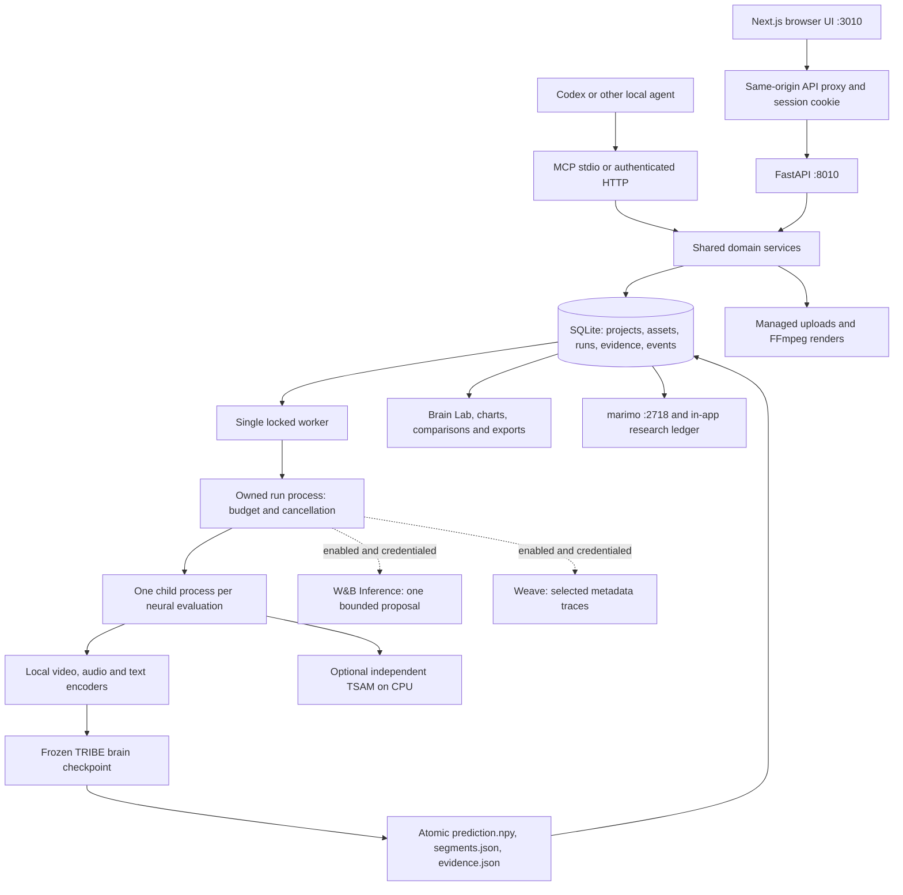

# NeuroLoop architecture

This document describes the implementation inspected during the September 10,
2026 operational audit. The system lives in `D:\NeuroLoop` and runs on one laptop.
See [AUDIT.md](AUDIT.md) for measured results and [REMAINING-WORK.md](REMAINING-WORK.md)
for gaps. Implemented does not mean scientifically validated or ready for public deployment.

## What the product actually does

NeuroLoop accepts media, predicts an average cortical response with pretrained
TRIBE v2, compares saved responses, and runs bounded edits against a fixed
reference-similarity objective. It records the inputs, predictions, changes,
costs and acceptance decisions. The browser and MCP use the same domain services.

It is an application built around pretrained models, with real orchestration,
inference, numerical scoring, storage and visualization. It is not a newly trained
foundation model or a measurement of a viewer's brain. The audit verifies numerical
output, not biological accuracy, ad effectiveness, preferences or purchase intent.

## Runtime and data flow

`scripts/manage.py` owns the API, Next.js server, research app and worker.
Windows job objects bind descendant lifetime to their owning supervisor. The
worker uses a file lock to serialize GPU jobs. The API queues work and returns
a run ID rather than keeping a request open for inference. Polling and recorded
run events provide progress. All three web services bind to loopback.

## Folder and responsibility map

| Location | Responsibility |
|---|---|
| `frontend/src/app` | Next.js routes, styles, authentication exchange and API proxy |
| `frontend/src/components` | Landing, workspace, forms, charts, Brain Lab, research and connections |
| `frontend/src/lib` | Shared browser API helpers and types |
| `frontend/public/brand` | Existing generated logo and enlarged favicon framing |
| `backend/neuroloop/api.py` | Authenticated endpoints, upload, frames, regions, comparison and ZIP export |
| `backend/neuroloop/services.py` | Validation, immutable run contracts, queue creation and workspace queries |
| `backend/neuroloop/mcp_server.py`, `mcp_extensions.py` | Fifteen agent tools over those same services |
| `backend/neuroloop/worker.py` | Job execution, references, cache, experiments, stopping and recovery |
| `backend/neuroloop/inference.py` | Local preprocessing, evaluation subprocess and actual model prediction |
| `backend/neuroloop/readout.py`, `comparison.py` | Numerical summaries and fixed response similarity |
| `backend/neuroloop/policy.py` | Context-specific edit statistics and Thompson sampling |
| `backend/neuroloop/tsam.py`, `anatomy.py` | Independent audiovisual logits and compatible anatomical readout |
| `backend/neuroloop/integrations.py`, `telemetry.py` | Optional planner and Weave export paths |
| `models` | Downloaded feature encoders, readout sources, manifests and local loader |
| `tribev2-balanced-qv-local` | Original brain checkpoint, local INT8 video weights and model environment |
| `research/lab.py`, `theme.css` | Local marimo research interface |
| `data/neuroloop.db` | Durable domain records; do not delete for troubleshooting |
| `data/assets`, `renders`, `results`, `exports` | Managed source files, edits, predictions and exports |
| `data/geometry`, `cache` | Surface/atlas data and feature caches |
| `data/verification`, `logs`, `build-backups` | Evidence, diagnostics and historical backups |
| `scripts` | Service lifecycle, preprocessing setup and verification commands |

The app uses `.venv`; the worker uses `tribev2-balanced-qv-local/.venv`. **Both
currently inherit system packages.** This is a reproducibility problem, not a
guarantee of environment isolation. Do not delete either before making replacement
environments and validating them. Some model directories are junctions to existing
downloads; moving their targets breaks them.

## Actual model path

1. Upload validation accepts supported local media. Files are hashed, inspected,
   registered and previewed. Remote media URLs and arbitrary FFmpeg expressions
   are not exposed as public inputs.
2. Video/audio become timed events. Audio is decoded to mono 16 kHz for local speech
   preprocessing. Faster-Whisper supplies word timings when speech is present;
   explicitly provided timings take precedence. Text requires real supplied timing.
3. A static image requires an explicitly acknowledged repeated-frame presentation.
   This is an experimental input adaptation, not proof of thumbnail effectiveness.
4. `models/load_local_tribe.py` selects V-JEPA2 INT8 video features, Llama-3.2-3B
   base NF4 text features and official Wav2Vec-BERT audio features. Audio encoding
   and video hidden-state pooling use CPU; GPU feature/model work is bounded.
   DINOv2-large is downloaded but inactive in the shipped feature configuration.
5. The original TRIBE brain checkpoint predicts using the shared feature timeline.
   The preprocessing grid is 2 Hz; output timestamps come from TRIBE's returned
   segments and must not be replaced by an assumed display rate.
6. Output is a finite `time × 20,484` array, left hemisphere then right, with
   10,242 fsaverage5 vertices each. The code atomically writes the array, returned
   segments and evidence. The audit independently recomputed these summaries.
7. Optional TSAM reads the original audiovisual source separately on CPU. It emits
   eight signed logits per complete five-second window. It is not a TRIBE decoder
   and contributes nothing to the optimization score.

The 20,484 points are **surface vertices, not individual neurons**. The brain UI
shows a cortical mesh, with surface/points/wireframe modes, hemisphere spacing,
timeline, region selection and compatible difference overlays. Destrieux provides
148 anatomical parcels. An anatomical name does not establish a psychological function.

## Optimization and what learns

The numerical objective is `spatially-centered-cosine/eight-normalized-time-bins/v1`.
Each response is interpolated to eight normalized time bins, spatially centered
and normalized per bin; the score is mean cosine similarity. Multiple references
are averaged and a per-reference regression check prevents hiding a tradeoff.

Allowed operators change contrast, brightness, saturation or editable headline
timing. FFmpeg creates actual files; every candidate is evaluated or reuses an
explicitly version-matched evaluation. Minimum gain, evaluation/time budgets,
allowed edits, audio/duration constraints and plateau stopping bound the loop.
There is no open-ended ad generation or arbitrary agent code execution.

Thompson sampling updates success/failure and compute-cost statistics for an edit
within its context. Its randomness selects experiments; it does not fabricate
cortical values. Model weights remain frozen. This is not human-feedback RLHF.
If enabled, W&B Inference may propose the first permitted edit, but cannot change
the scoring function or run budget. Invalid/unavailable proposals leave the local
policy available and are recorded as such.

## Persistence and recovery

SQLite stores assets, projects, runs, evaluations, experiments, events, policy
statistics and archive markers. Run creation snapshots the project and asset
metadata so later edits do not silently change a queued contract. Source hashes,
model profile and preprocessing options form evaluation cache keys. Feature caches
can also be reused; timings therefore are not necessarily cold-start timings.

Each run and each evaluation has an owned process. Per-evaluation exit releases
resident model allocations before the next candidate. Preflight checks GPU
temperature, free VRAM and system RAM; PyTorch allocation is capped at 75% of VRAM.
These are pressure controls, not a driver-crash cure. The supervisor enforces
timeouts/cancellation. Interrupted running jobs are failed, with completed evidence
retained, rather than automatically replaying a potentially problematic workload.

Archive markers hide earlier technical fixtures from the active workspace while
retaining their media and research records. Export ZIPs contain the selected
creative, actual arrays and evidence. Backups exist, but automated backup rotation
and a documented restore rehearsal remain unfinished.

## Access and external services

The UI obtains a local eight-hour session stored in an HTTP-only, SameSite-strict
cookie. The backend validates bearer tokens; MCP HTTP uses the same boundary.
MCP stdio is an explicitly trusted local process with access to the same database.
It is not a per-user security boundary. Sign-out clears the browser cookie; there
is no explicit server-side session revocation endpoint today.

The app is single-workspace and does not implement accounts, tenant isolation,
billing or public hosting. marimo is a local process, not a separately secured
multi-user research server. Untrusted local programs are outside this boundary.

See [SPONSORS.md](SPONSORS.md) for exactly what leaves the computer when optional
integrations are enabled. ARIA, cloud compute and TypeSafe are not functioning
backend integrations in this installation. Labels or links in a UI are not proof
of those services being connected.
